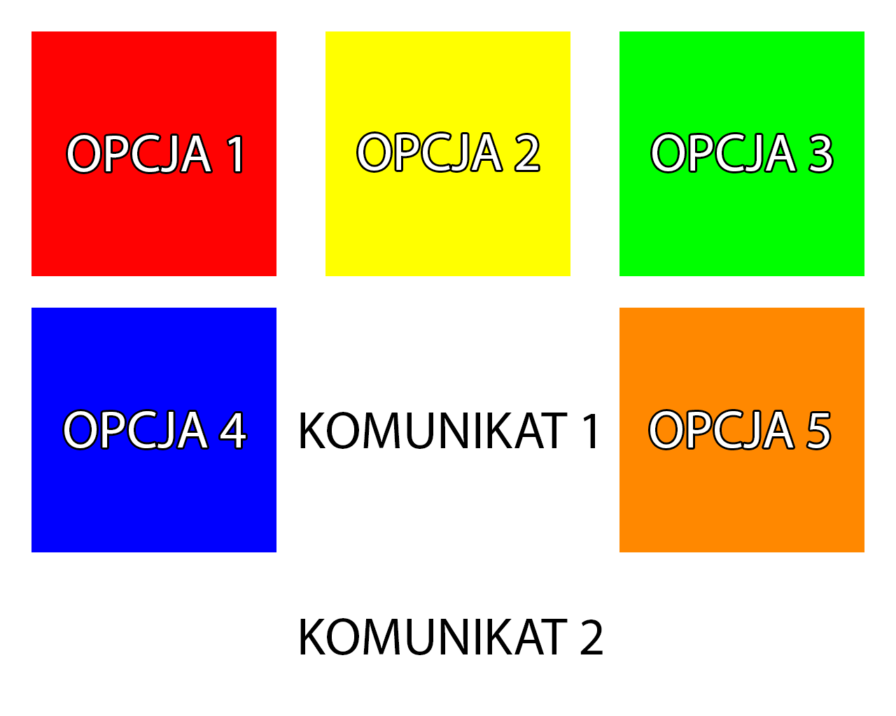
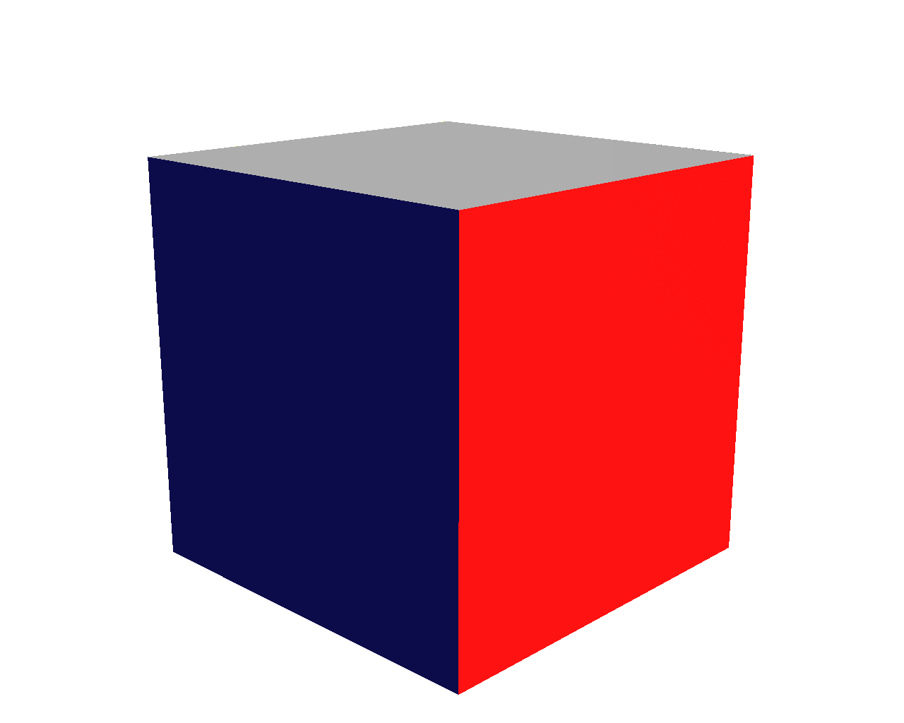
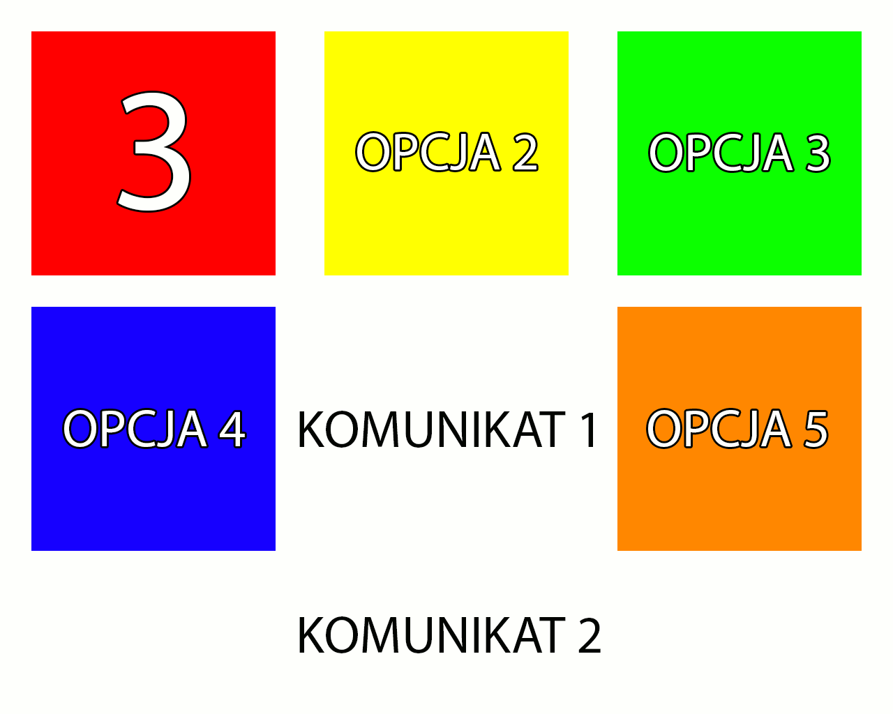
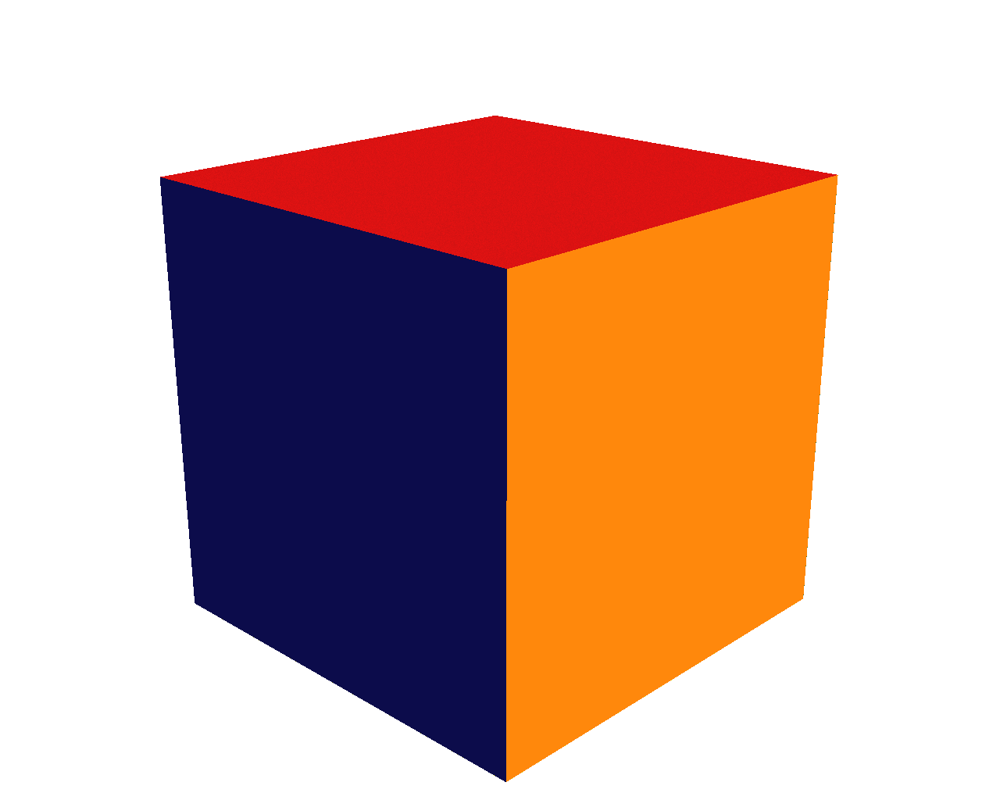

# Cube

![Language][language-1-url] ![Language][language-2-url] ![License][license-url] ![Version][version-url] ![Done][done-url] ![Maintenance][maintenance-url]

### Realization of Bluetooth communication between STM32 module (imitating rehabilitation device) and desktop application

##### This project was developed for *Motor Rehabilitation Engineering* classes at Electronics, Telecommunications and Informatics faculty of Gdańsk University of Technology. Although six people participated in the project, the software was made only by me (documentation in approx. 95%).

## About

This project was all about creating a human-computer interface in form of a cube (something like Xiaomi Mi Magic Controller) whose position/orientation in space should controll the desktop application. Cube sides should detect touching and signal which side is turned up.
My task was realization of Bluetooth communicaton between the cube and PC + desktop application.

## How it works

Desktop application GUI is in the form of five color squares that respond to user actions (moving the cube). At application start the cube should be in neutral position (neutral side at top of the cube).

 

After moving/rotating the cube the side that is on top will be reflected in desktop application and after 3 seconds the correct square (option) will be chosen.

 

There is a two way communication between cube and desktop application. The data frame from application to cube looks like this:
- `XXXXX` - five Xs, because there are 5 functional sides in cube (1 neutral). Where X can be either 0 or 1. 0 represents that this side (index of X) is active at the moment and 1 vice versa.

The data frame from cube to desktop application looks as follows:
- `XX` - first X means index of active side (on top), the second one represents status of *back* button (1 when side was clicked).

## Demo

## [Documentation](docs/)

Documentation is in form of five PDF files that cover researching, planning and realization of this project. Unfortunately it's only available in Polish language.

- [Work plan](docs/0_Plan_prac.pdf)
- [Literature review](docs/1_Przegląd_literatury.pdf)
- [Analysis of existing/similar solutions](docs/2_Analiza_istniejących_rozwiązań.pdf)
- [Project specification](docs/3_Specyfikacja_projektu.pdf)
- [Realization](docs/4_Dokumentacja.pdf)

## Technologies

- [Desktop application](Desktop%20Application/) was written in **Java** and GUI in **JavaFX**
- [STM32 software](STM32%20Software/) was written in **C** with **HAL** libraries

## Used libraries

- [BlueCove](http://www.bluecove.org/) | Apache License 2.0

[license-url]: https://img.shields.io/badge/license-MIT-blue.svg?style=flat "License"
[version-url]: https://img.shields.io/badge/version-1.0.0-brightgreen.svg?style=flat "Version"
[maintenance-url]: https://img.shields.io/maintenance/no/2016.svg?style=flat "Maintenance"
[language-1-url]: https://img.shields.io/badge/language-C-lightgrey.svg?style=flat "Language"
[language-2-url]: https://img.shields.io/badge/language-Java-lightgrey.svg?style=flat "Language"
[done-url]: https://img.shields.io/badge/done-06.2016-yellow.svg?style=flat "Done"
